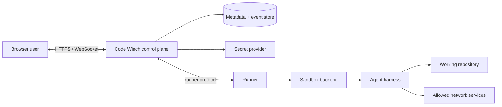
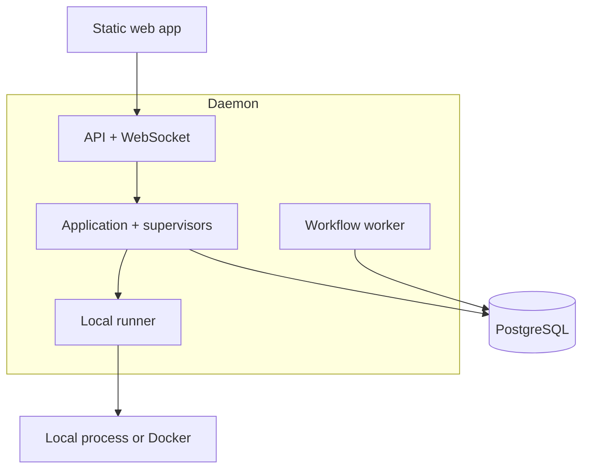

# System architecture

## 1. Context and goals

Code Winch manages interactive coding-agent harnesses on behalf of browser
users. A harness is a provider-specific CLI or API session (for example, an
agent running in a pseudo-terminal), while a run is Code Winch's durable record
of that execution.

The design must support:

1. starting, stopping, observing, and communicating with harnesses;
2. browser-based interaction, including login and streaming output;
3. local-process isolation initially and container or other sandbox backends
   without changing the domain model;
4. multiple harness providers with different protocols and capabilities;
5. alternative representations of one canonical output stream; and
6. top-level workflows coordinating one or more runs.

### Non-goals for the first release

- implementing a general container orchestrator;
- allowing arbitrary third-party renderer code in the browser or API process;
- guaranteeing deterministic replay of an external coding agent;
- building a multi-tenant SaaS control plane before the single-user trust model
  is working; or
- hiding provider-specific features behind a lowest-common-denominator UI.

## 2. Guiding constraints

- **Stable core, replaceable edges.** Domain types know about runs, messages,
  events, artifacts, and workflows—not Docker, PTYs, or a vendor CLI.
- **One writer per run.** A run supervisor serializes lifecycle commands and
  event sequence assignment, avoiding start/stop/input races.
- **Events are the integration seam.** Raw transport bytes are retained when
  appropriate, but normalized immutable events are the source for UI updates,
  renderers, audit, and workflow decisions.
- **Capabilities, not assumptions.** Harness and sandbox drivers declare
  whether they support resize, pause, structured messages, snapshots, network
  policies, and similar features.
- **Secure defaults.** Credentials are references to secrets, sandbox egress is
  explicit, and browser clients never receive harness credentials.
- **Modular monolith first.** Clear in-process ports precede network services.
  Components become services only when isolation or scaling justifies it.

## 3. System context



The **control plane** owns identity, authorization, run metadata, workflows,
subscriptions, and API semantics. The **runner** owns machine-local resources:
processes, PTYs, containers, workspace mounts, and signal delivery. Initially
they are modules in one daemon; the runner boundary must nevertheless use
serializable commands and events so it can later move to another host.

## 4. Logical components

### Web application

- run and workflow lists;
- terminal-like live view plus structured timeline views;
- input composer, approval prompts, stop controls, and reconnect behavior;
- renderer selection based on event type and user preference; and
- explicit display of sandbox, credential, and network posture.

The browser consumes snapshots over HTTP and ordered event deltas over a
WebSocket. It does not connect directly to a harness.

### API and application services

The API validates requests, authenticates users, authorizes workspace/run
access, converts HTTP operations into application commands, and maps domain
errors to stable problem responses. Application services implement use cases
such as `CreateRun`, `StartRun`, `SendInput`, `StopRun`, `ResumeSubscription`,
and `StartWorkflow`.

### Run supervisor

Each active run has one logical supervisor. It:

- enforces the run state machine;
- leases execution ownership so only one runner controls a run;
- resolves harness and sandbox drivers from registries;
- redacts and sequences events before persistence/publication;
- applies input idempotency keys; and
- reconciles persisted intent with observed runner state after restart.

A daemon sweeps every in-flight run at startup, before its listener accepts a
request, and reconciles each one. Reconciliation records its conclusion as the
run's desired state; the sweep also moves the run's attempt to match, because
the attempt state is what readers of the API see. A run whose execution died
with the previous daemon therefore reports a terminal state, and refuses input,
from the first request the new daemon answers.

Supervisors need not be permanent goroutines. An actor-like mailbox backed by a
database lease permits rehydration and later horizontal scaling.

### Harness adapters

A harness adapter is the provider-specific translation layer between Code
Winch and one coding-agent CLI or API. Its purpose is to keep provider checks
and wire formats out of the run supervisor, workflows, and generic UI. For
example, the same Code Winch `UserMessage` might be encoded as a JSON record for
one agent and as text written to a PTY for another; both agents' replies are
decoded into the same canonical message and tool-call events.

The adapter:

- describes the harness's supported capabilities, such as structured messages,
  terminal resize, approvals, resume, and usage reporting;
- converts a generic run specification into an executable, arguments, terminal
  requirements, and other launch instructions;
- incrementally decodes native stdout, stderr, or protocol messages into
  normalized events and encodes generic user input into native input frames;
- maps native exits and errors to stable Code Winch outcomes; and
- may preserve provider-only data in a namespaced extension so a specialized UI
  can use it without making the core schema provider-specific.

The launch instructions are handed to the selected sandbox driver. This keeps
the two independent choices composable: **which agent to run** belongs to the
harness adapter, while **where and under which isolation policy to run it**
belongs to the sandbox driver. Consequently, adding a Docker or future microVM
backend does not require a separate implementation for every agent.

Adapters do **not** create containers, access the web session, store secrets, or
write directly to the event store. The runner owns process I/O, the supervisor
redacts and sequences adapter-produced events, and the event store persists
them. Keeping these boundaries prevents provider code from bypassing lifecycle,
security, and ordering rules.

### Sandbox drivers

A sandbox driver prepares an execution environment and returns a transport the
runner can control. Initial drivers are:

- `local`: subprocess plus PTY, intended for trusted development;
- `docker`: container, workspace mount, resource limits, and network policy.

Future drivers might target rootless Podman, microVMs, Kubernetes jobs, or a
remote execution service. They conform to the same prepare/start/stop/inspect/
cleanup lifecycle and publish their capabilities.

### Event pipeline and renderers

The ingestion path is:

```text
harness bytes/messages -> adapter parser -> normalized event -> redaction
  -> sequence assignment -> transactionally persisted event -> publication
  -> renderer projection -> browser
```

Canonical events are durable facts. A renderer is a pure projection from events
to view models (terminal frames, Markdown conversation turns, tool-call cards,
diff summaries). Renderer failures cannot affect execution. Experimental or
untrusted server-side renderers run out of process with bounded input, time,
memory, and no credentials; the core built-in renderers may run in process.

### Workflow coordinator

A workflow is a durable graph/state machine that issues normal application
commands and waits for domain events. Steps include starting a run, sending a
message, waiting for an approval/result, applying a policy gate, and launching
parallel branches. The coordinator never controls a process directly.

The first implementation can persist workflow state in the primary database
and use an outbox-driven worker. A dedicated durable-workflow engine can replace
it later through the `WorkflowRuntime` port without changing workflow
definitions or run semantics.

## 5. Deployment evolution

### Phase A: single-node modular monolith



PostgreSQL is preferred even for the first shared deployment because leases,
transactions, event ordering, and an outbox are central requirements. SQLite
may be offered as an explicitly single-process developer profile.

### Phase B: isolated/remote runners

Move the runner to one or more hosts. The control plane dispatches commands over
an authenticated, versioned runner protocol. Runners maintain heartbeats and
lease tokens; stale runners cannot append events after ownership changes.

### Phase C: scale by responsibility

API replicas remain stateless, supervisors/workflow workers claim leases, event
delivery may use a broker while PostgreSQL remains authoritative, and renderer
workers can have a separate security profile. This is an evolution, not the
required initial topology.

## 6. Key data model

| Aggregate | Purpose | Important fields |
|---|---|---|
| Workspace | Root and policy boundary for checked-out code | id, owner, source, policy |
| Run | Durable intent and observed harness execution | id, workspace, harness profile, sandbox profile, state, lease epoch |
| RunEvent | Immutable ordered fact | run id, sequence, kind, timestamp, payload, sensitivity |
| InputCommand | Idempotent user/workflow input | id, run id, actor, content reference, status |
| Artifact | File/diff/log produced by a run | id, run id, media type, digest, storage reference |
| Credential | Metadata and secret-manager reference only | id, owner, provider, secret reference |
| Workflow | Definition plus version | id, definition id/version, inputs, status |
| WorkflowStep | Durable step attempt | workflow id, step id, attempt, state, output references |

Large binary output and artifacts belong in object storage; metadata and event
envelopes belong in the database. Every mutation that publishes an event uses a
transactional outbox to prevent database/pub-sub divergence.

## 7. Reliability and observability

- Commands carry idempotency keys; events carry monotonically increasing
  per-run sequence numbers and globally unique IDs.
- A subscriber reconnects with `after_sequence`; a snapshot plus later events
  repairs gaps.
- Desired state (`stop requested`) is persisted before runner interaction.
- Stop is escalation-based: graceful request, deadline, terminate, deadline,
  force kill, cleanup. Every transition is observable.
- Metrics cover queue time, startup time, active runs, dropped live
  subscribers, parser failures, workflow retries, and cleanup failures.
- Logs and traces include run/workflow IDs but exclude message content and
  secrets by default.

## 8. Technology baseline

The recommended starting stack is a **Go daemon** (strong process, PTY,
concurrency, and static deployment support), a **TypeScript/React web app**,
PostgreSQL, and an OpenAPI-described HTTP API with WebSockets for live events.
This is an implementation choice behind the architectural ports, not a protocol
requirement. Generated API clients and schema compatibility tests prevent the
Go/TypeScript boundary from drifting.
