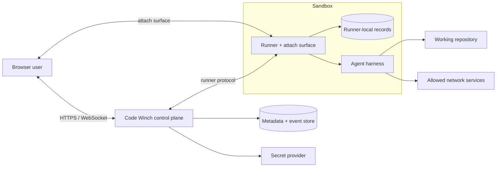
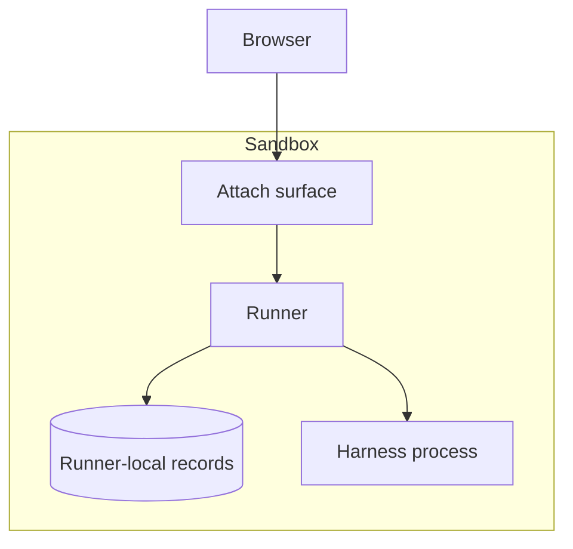
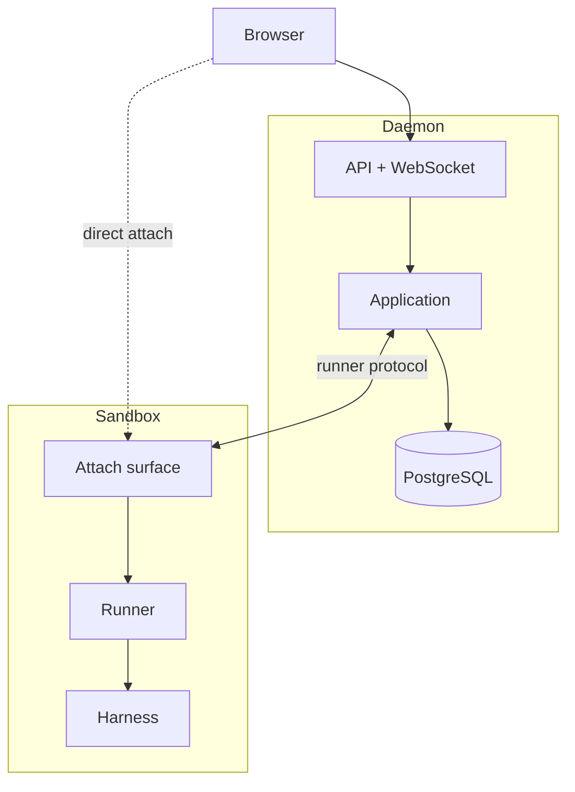

# System architecture

## 1. Context and goals

Code Winch manages interactive coding-agent harnesses on behalf of browser
users. A harness is a provider-specific CLI or API session (for example, an
agent running in a pseudo-terminal), while a run is Code Winch's durable record
of that execution.

The design must support:

1. starting, stopping, observing, and communicating with harnesses;
2. browser-based interaction, including login and streaming output;
3. a container sandbox as the first backend, with local-process and other
   backends added without changing the domain model;
4. multiple harness providers with different protocols and capabilities;
5. alternative representations of one canonical output stream; and
6. top-level workflows coordinating one or more runs.

### Non-goals for the first release

- implementing a general container orchestrator;
- allowing arbitrary third-party renderer code in the browser or API process;
- guaranteeing deterministic replay of an external coding agent;
- building a multi-tenant SaaS control plane before the single-user trust model
  is working; or
- hiding provider-specific features behind a lowest-common-denominator UI.

## 2. Guiding constraints

- **Stable core, replaceable edges.** Domain types know about runs, messages,
  events, artifacts, and workflows—not Docker, PTYs, or a vendor CLI.
- **One writer per run.** A run supervisor serializes lifecycle commands and
  event sequence assignment, avoiding start/stop/input races.
- **Events are the integration seam.** Raw transport bytes are retained when
  appropriate, but normalized immutable events are the source for UI updates,
  renderers, audit, and workflow decisions.
- **Capabilities, not assumptions.** Harness and sandbox drivers declare
  whether they support resize, pause, structured messages, snapshots, network
  policies, and similar features.
- **Secure defaults.** Credentials are references to secrets, sandbox egress is
  explicit, and browser clients never receive harness credentials.
- **A sandbox is self-sufficient.** It holds its harness, the runner that owns
  that harness, and an attach surface a browser connects to, and it is useful
  with no control plane deployed. Components outside it arrive when a second
  case forces them rather than in advance — see
  [ADR-0005](decisions/0005-sandbox-resident-runner.md), which supersedes the
  in-process-first sequencing of ADR-0001.

## 3. System context


```mermaid
flowchart LR
    U[Browser user] <-->|HTTPS / WebSocket| CP[Code Winch control plane]
    U <-->|attach surface| R
    CP --> DB[(Metadata + event store)]
    CP --> SEC[Secret provider]
    CP <-->|runner protocol| R
    subgraph SB[Sandbox]
      R[Runner + attach surface] --> LOG[(Runner-local records)]
      R --> H[Agent harness]
    end
    H --> REPO[Working repository]
    H --> NET[Allowed network services]
```

The **control plane** owns identity, authorization, run metadata, workflows,
subscriptions, and API semantics. The **runner** owns machine-local resources:
the harness process, PTYs, workspace mounts, signal delivery, and a private
ordered record of what the harness produced. The runner lives inside the
sandbox, in its own process, so the runner boundary is a network protocol rather
than an in-process call.

The browser reaches a harness two ways, and they are not alternatives — see
[ADR-0006](decisions/0006-two-interaction-surfaces.md). The **control-plane
application** is the product surface, over many runs. The **attach surface** a
sandbox serves itself is the operator and debug path for the one session inside
it, and remains available when no control plane is deployed or when the control
plane is the thing that is broken. Neither surface connects to the harness
process directly; both go through the runner.

## 4. Logical components

### Web application

- run and workflow lists;
- terminal-like live view plus structured timeline views;
- input composer, approval prompts, stop controls, and reconnect behavior;
- renderer selection based on event type and user preference; and
- explicit display of sandbox, credential, and network posture.

The browser consumes snapshots over HTTP and ordered event deltas over a
WebSocket. It does not connect directly to a harness.

### Sandbox attach surface

The same sandbox that runs a harness serves a small HTTP and WebSocket surface
over that one session: the records the runner has collected, a live stream of new
ones, and input submission. It is the operator and debug path, and it is the
maintained hands-on path that does not depend on the state of the product UI.

Its job is deliberately narrower than the web application's: one session, one
harness, no run list, no search, no workflow views, no multi-user access. What
the two surfaces do share is record projections — terminal, conversation,
activity, changes are one implementation over one record shape, not two.
[ADR-0006](decisions/0006-two-interaction-surfaces.md) states the split and the
non-goal; `docs/roadmap.md` D2 settles whether the shared projections live in one
web workspace or two.

Because this surface sits inside the sandbox, a browser talking to it is talking
to a process that shares a container with an untrusted agent. That boundary and
its controls are in [the security model](security.md#2-trust-boundaries), and
§11 there blocks exposing it in a shared deployment.

### API and application services

The API validates requests, authenticates users, authorizes workspace/run
access, converts HTTP operations into application commands, and maps domain
errors to stable problem responses. Application services implement use cases
such as `CreateRun`, `StartRun`, `SendInput`, `StopRun`, `ResumeSubscription`,
and `StartWorkflow`.

### Run supervisor

Each active run has one logical supervisor. It:

- enforces the run state machine;
- leases execution ownership so only one runner controls a run;
- resolves harness and sandbox drivers from registries;
- redacts and sequences events before persistence/publication;
- applies input idempotency keys; and
- reconciles persisted intent with observed runner state after restart.

Supervisors need not be permanent goroutines. An actor-like mailbox backed by a
database lease permits rehydration and later horizontal scaling.

### Harness adapters

A harness adapter is the provider-specific translation layer between Code
Winch and one coding-agent CLI or API. Its purpose is to keep provider checks
and wire formats out of the run supervisor, workflows, and generic UI. For
example, the same Code Winch `UserMessage` might be encoded as a JSON record for
one agent and as text written to a PTY for another; both agents' replies are
decoded into the same canonical message and tool-call events.

The adapter:

- describes the harness's supported capabilities, such as structured messages,
  terminal resize, approvals, resume, and usage reporting;
- converts a generic run specification into an executable, arguments, terminal
  requirements, and other launch instructions;
- incrementally decodes native stdout, stderr, or protocol messages into
  normalized events and encodes generic user input into native input frames;
- maps native exits and errors to stable Code Winch outcomes; and
- may preserve provider-only data in a namespaced extension so a specialized UI
  can use it without making the core schema provider-specific.

The launch instructions are handed to the selected sandbox driver. This keeps
the two independent choices composable: **which agent to run** belongs to the
harness adapter, while **where and under which isolation policy to run it**
belongs to the sandbox driver. Consequently, adding a Docker or future microVM
backend does not require a separate implementation for every agent.

Adapters do **not** create containers, access the web session, store secrets, or
write directly to the event store. The runner owns process I/O, the supervisor
redacts and sequences adapter-produced events, and the event store persists
them. Keeping these boundaries prevents provider code from bypassing lifecycle,
security, and ordering rules.

### Sandbox drivers

A sandbox driver prepares an execution environment and returns a transport the
runner can control. Initial drivers are:

- `local`: subprocess plus PTY, intended for trusted development;
- `docker`: container, workspace mount, resource limits, and network policy.

Future drivers might target rootless Podman, microVMs, Kubernetes jobs, or a
remote execution service. They conform to the same prepare/start/stop/inspect/
cleanup lifecycle and publish their capabilities.

Among those capabilities is whether the sandbox **hosts the runner and serves an
attach surface** of its own, or only accepts a command and returns output. A
driver that hosts the runner is reachable by a browser directly and is useful
with no control plane; one that does not must be driven entirely through the
control plane, and the attach surface is unavailable for it. The `docker` driver
hosts the runner — that is the configuration the first delivery stage ships. A
hypothetical remote execution service is the case that would not, and is the
trigger for revisiting ADR-0005.

### Event pipeline and renderers

The ingestion path is:

```text
harness bytes/messages -> adapter parser -> normalized event -> redaction
  -> sequence assignment -> transactionally persisted event -> publication
  -> renderer projection -> browser
```

Sequence assignment is split across the two processes. The runner assigns
**runner-local ordinals** and persists records to the sandbox's own store, which
is what makes a standalone sandbox able to replay a session. The control plane
assigns **canonical sequence numbers** when it persists, so a record has a local
ordinal from the moment the runner sees it and a canonical sequence only once a
control plane is in the path. Roadmap decision D7 settles whether that promotion
wraps the runner's record shape or replaces it.

Canonical events are durable facts. A renderer is a pure projection from events
to view models (terminal frames, Markdown conversation turns, tool-call cards,
diff summaries). Renderer failures cannot affect execution. Experimental or
untrusted server-side renderers run out of process with bounded input, time,
memory, and no credentials; the core built-in renderers may run in process.

Projections are shared between the attach surface and the web application, so a
projection's input is a record shape both can produce. A projection that
requires a control-plane-only type is not usable from a standalone sandbox, and
that constraint binds the record model rather than the renderer.

### Workflow coordinator

A workflow is a durable graph/state machine that issues normal application
commands and waits for domain events. Steps include starting a run, sending a
message, waiting for an approval/result, applying a policy gate, and launching
parallel branches. The coordinator never controls a process directly.

The first implementation can persist workflow state in the primary database
and use an outbox-driven worker. A dedicated durable-workflow engine can replace
it later through the `WorkflowRuntime` port without changing workflow
definitions or run semantics.

## 5. Deployment evolution

Each topology below is a configuration that runs and can be driven by hand, not
a step toward one. The letters are topologies, not delivery stages — the
numbered stages belong to [`docs/roadmap.md`](roadmap.md), and each heading says
which of them produces this topology.

### Topology A: a standalone sandbox — roadmap stages 0–2


```mermaid
flowchart TB
  WEB[Browser] --> ATT[Attach surface]
  subgraph Sandbox
    ATT --> RUN[Runner]
    RUN --> STORE[(Runner-local records)]
    RUN --> H[Harness process]
  end
```

One container, started by hand, bound to loopback. No control plane, no
accounts, no network policy, and no concept of a run. The record store is
private to the sandbox and holds runner-local ordinals; the substrate is
whatever satisfies a single session's ordered record, which is roadmap decision
D3. This is the whole system at the first delivery stage, and it stays a
supported configuration afterwards.

### Topology B: a control plane that observes — roadmap stage 3


```mermaid
flowchart TB
  WEB[Browser] --> API[API + WebSocket]
  WEB -.direct attach.-> ATT
  subgraph Daemon
    API --> APP[Application]
    APP --> DB[(PostgreSQL)]
  end
  APP <-->|runner protocol| ATT
  subgraph Sandbox
    ATT[Attach surface] --> RUN[Runner] --> H[Harness]
  end
```

Sandboxes are still started by hand, and register themselves with the daemon.
The daemon lists them, records runs for executions that already exist, and
routes a user to a sandbox's surface. PostgreSQL enters here, with the daemon,
because leases, transactions, canonical event ordering, and an outbox are what it
is for — none of which a single standalone sandbox needs. SQLite may be offered
as an explicitly single-process developer profile of the daemon.

### Topology C: a control plane that starts runs — roadmap stages 4–5

The daemon gains supervisors, the run state machine, lease fencing, and a
workflow worker, and prepares and starts sandboxes itself. The manual start goes
away; the attach surface does not.

### Topology D: scale by responsibility — beyond the roadmap

API replicas remain stateless, supervisors and workflow workers claim leases,
event delivery may use a broker while PostgreSQL remains authoritative, and
renderer workers can have a separate security profile. This is an evolution, not
a required topology.

## 6. Key data model

| Aggregate | Purpose | Important fields |
|---|---|---|
| Workspace | Root and policy boundary for checked-out code | id, owner, source, policy |
| Run | Durable intent and observed harness execution | id, workspace, harness profile, sandbox profile, state, lease epoch |
| RunEvent | Immutable ordered fact | run id, sequence, kind, timestamp, payload, sensitivity |
| InputCommand | Idempotent user/workflow input | id, run id, actor, content reference, status |
| Artifact | File/diff/log produced by a run | id, run id, media type, digest, storage reference |
| Credential | Metadata and secret-manager reference only | id, owner, provider, secret reference |
| Workflow | Definition plus version | id, definition id/version, inputs, status |
| WorkflowStep | Durable step attempt | workflow id, step id, attempt, state, output references |

Large binary output and artifacts belong in object storage; metadata and event
envelopes belong in the database. Every mutation that publishes an event uses a
transactional outbox to prevent database/pub-sub divergence.

Every aggregate above belongs to the control plane. A sandbox holds one
**session** — the harness execution it was started for, and the ordinal-ordered
records the runner collected from it — and nothing else. A session is not a run:
it has no workspace policy, no lease epoch, no attempt history, and no identity
beyond the sandbox it lives in. A run is what the control plane records *about* a
session, which is why the run aggregate can arrive several stages after the
sandbox that produces the records.

## 7. Reliability and observability

- Commands carry idempotency keys; events carry monotonically increasing
  per-run sequence numbers and globally unique IDs.
- A subscriber reconnects with `after_sequence`; a snapshot plus later events
  repairs gaps.
- Desired state (`stop requested`) is persisted before runner interaction.
- Stop is escalation-based: graceful request, deadline, terminate, deadline,
  force kill, cleanup. Every transition is observable.
- Metrics cover queue time, startup time, active runs, dropped live
  subscribers, parser failures, workflow retries, and cleanup failures.
- Logs and traces include run/workflow IDs but exclude message content and
  secrets by default.

## 8. Technology baseline

The recommended starting stack is **Go** for both composition roots — the
sandbox-resident runner and the control-plane daemon — for its process, PTY,
concurrency, and static-binary support, a **TypeScript/React** browser stack, and
an OpenAPI-described HTTP API with WebSockets for live records. This is an
implementation choice behind the architectural ports, not a protocol
requirement. Generated API clients and schema compatibility tests prevent the
Go/TypeScript boundary from drifting.

The two processes do not share a store. PostgreSQL belongs to the **control
plane**, where leases, transactions, canonical ordering, and an outbox are
central requirements; SQLite may be offered as an explicitly single-process
developer profile of it. A **sandbox** persists one session's ordered records
and needs none of those properties, so its substrate is chosen for being small
and dependency-free rather than for transactional guarantees — roadmap decision
D3. A sandbox that required PostgreSQL to start would not be a sandbox you can
start by hand.
