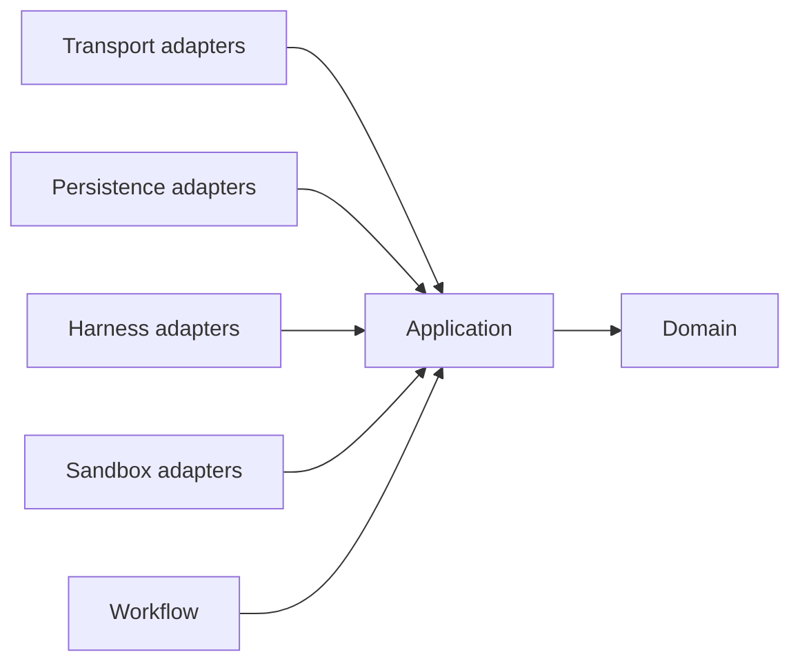

# Repository and package structure

## 1. Proposed monorepo

```text
code-winch/
├── cmd/
│   ├── winchd/                  # daemon composition root
│   └── winch-runner/            # future standalone runner composition root
├── internal/
│   ├── domain/                  # dependency-free entities, value types, state machines
│   ├── application/             # use cases and ports
│   ├── supervisor/              # per-run serialization, leases, reconciliation
│   ├── workflow/                # definitions, coordinator, runtime port
│   ├── adapters/
│   │   ├── harness/             # one package per coding-agent integration
│   │   ├── sandbox/             # local, docker, future backends
│   │   ├── persistence/         # PostgreSQL repositories and outbox
│   │   ├── secrets/             # OS keychain/file/vault adapters
│   │   └── transport/           # HTTP, WebSocket, runner RPC
│   └── platform/                # config, telemetry, clock, IDs
├── pkg/protocol/                # versioned runner/event wire schemas only
├── web/
│   ├── src/app/                 # routes and application shell
│   ├── src/features/            # run/workflow/auth vertical UI slices
│   ├── src/renderers/            # terminal, conversation, tool, diff projections
│   └── src/api/                  # generated client and stream reconnection
├── api/openapi/                 # public API source of truth
├── schemas/                     # event and runner protocol schemas
├── migrations/                  # ordered database migrations
├── deployments/                 # local compose and production examples
├── docs/                        # architecture and operational design
└── test/
    ├── contract/                # adapter/protocol compatibility suites
    ├── integration/             # database, Docker, PTY tests
    └── e2e/                     # browser-to-fake-harness scenarios
```

Directories should be created when their first implementation is added; this
document is not a request for empty scaffolding.

## 2. Dependency rule



Dependencies point inward. Domain code imports no adapters, database packages,
web frameworks, Docker clients, or provider SDKs. Application packages define
ports; outer adapters implement them; a `cmd` composition root wires concrete
implementations. Cross-adapter imports are prohibited.

## 3. Principal ports

The names below describe responsibilities rather than freezing Go signatures.

```go
type HarnessDriver interface {
    Describe(ctx context.Context) (HarnessDescriptor, error)
    BuildLaunch(ctx context.Context, RunSpec, ResolvedCredentials) (LaunchSpec, error)
    NewCodec(ctx context.Context, RunSpec) (HarnessCodec, error)
}

type HarnessCodec interface {
    Consume(OutputChunk) ([]UnsequencedEvent, error)
    Encode(InputMessage) ([]InputFrame, error)
    Flush() ([]UnsequencedEvent, error)
}

type SandboxDriver interface {
    Capabilities(ctx context.Context) SandboxCapabilities
    Prepare(ctx context.Context, SandboxSpec) (PreparedSandbox, error)
    Start(ctx context.Context, PreparedSandbox, LaunchSpec) (ExecutionHandle, error)
    Attach(ctx context.Context, ExecutionHandle) (io.ReadWriteCloser, error)
    Inspect(ctx context.Context, ExecutionHandle) (ObservedExecution, error)
    Stop(ctx context.Context, ExecutionHandle, StopPolicy) error
    Cleanup(ctx context.Context, PreparedSandbox) error
}

type EventStore interface {
    Append(ctx context.Context, RunID, ExpectedSequence, []UnsequencedEvent) ([]RunEvent, error)
    Read(ctx context.Context, RunID, AfterSequence, Limit) ([]RunEvent, error)
}

type WorkflowRuntime interface {
    Start(ctx context.Context, WorkflowInstance) error
    Signal(ctx context.Context, WorkflowID, WorkflowSignal) error
    ClaimReadySteps(ctx context.Context, WorkerID, Limit) ([]StepLease, error)
}
```

Sandbox capabilities explicitly report whether attached I/O is available and
whether attachment is single-use. The local runner is the sole owner of opaque
execution handles and harness codecs; it pumps attached bytes into codecs and
emits runner-local ordinals, never canonical event sequence numbers.

`ResolvedCredentials` is short-lived and can be used only during sandbox
preparation/launch. It must never appear in `RunSpec`, persisted events, or
logs. An execution handle is opaque outside its sandbox adapter.

## 4. Adding a harness

Each harness package contains:

1. a descriptor with stable ID, adapter version, supported input/output modes,
   login modes, and capabilities;
2. configuration validation and launch-spec construction;
3. an incremental codec tolerant of arbitrary byte chunk boundaries;
4. mappings from native messages/exits to canonical events;
5. namespaced extension schemas for provider-only data; and
6. a contract-test fixture using a fake CLI or recorded, sanitized transcript.

Harness registration is explicit in the composition root. Loading arbitrary
in-process plugins is deferred because it weakens supply-chain and isolation
controls. Later third-party integrations should use a versioned subprocess
plugin protocol.

## 5. Adding a sandbox

A sandbox package owns resource naming, preparation, start/attach, inspection,
stop escalation, and cleanup. It must pass the shared sandbox contract suite:

- workspace visibility and write policy;
- environment/secret injection behavior;
- stdout/stderr ordering guarantees as declared by capability;
- terminal resizing if advertised;
- stop escalation and orphan cleanup;
- resource limits and network policy enforcement; and
- idempotent inspect/stop/cleanup operations.

The `local` adapter must label unsupported controls honestly; it must not claim
filesystem or network isolation.

## 6. Configuration layers

Configuration resolves in this order: compiled safe defaults, system config,
workspace policy, named harness/sandbox profile, and allowed per-run overrides.
Policy decides which fields are overridable. The fully resolved non-secret
configuration is stored with a run for reproducibility. Secrets remain opaque
references and are resolved only at launch.

## 7. Testing boundaries

- **Domain tests:** table/property tests for state machines and invariants.
- **Adapter contract tests:** the same suite against each harness and sandbox.
- **Protocol compatibility tests:** old fixtures decode; new optional fields are
  ignored; supported version negotiation is verified.
- **Integration tests:** real PTY, PostgreSQL, and opt-in Docker execution.
- **End-to-end tests:** browser + daemon + deterministic fake harness.
- **Security tests:** traversal, secret redaction, authorization, escape-prone
  sandbox configurations, and malicious renderer payloads.

Fake time, ID generation, runner, secret store, and event publisher are injected
through ports so tests do not rely on sleeps or actual provider accounts.
