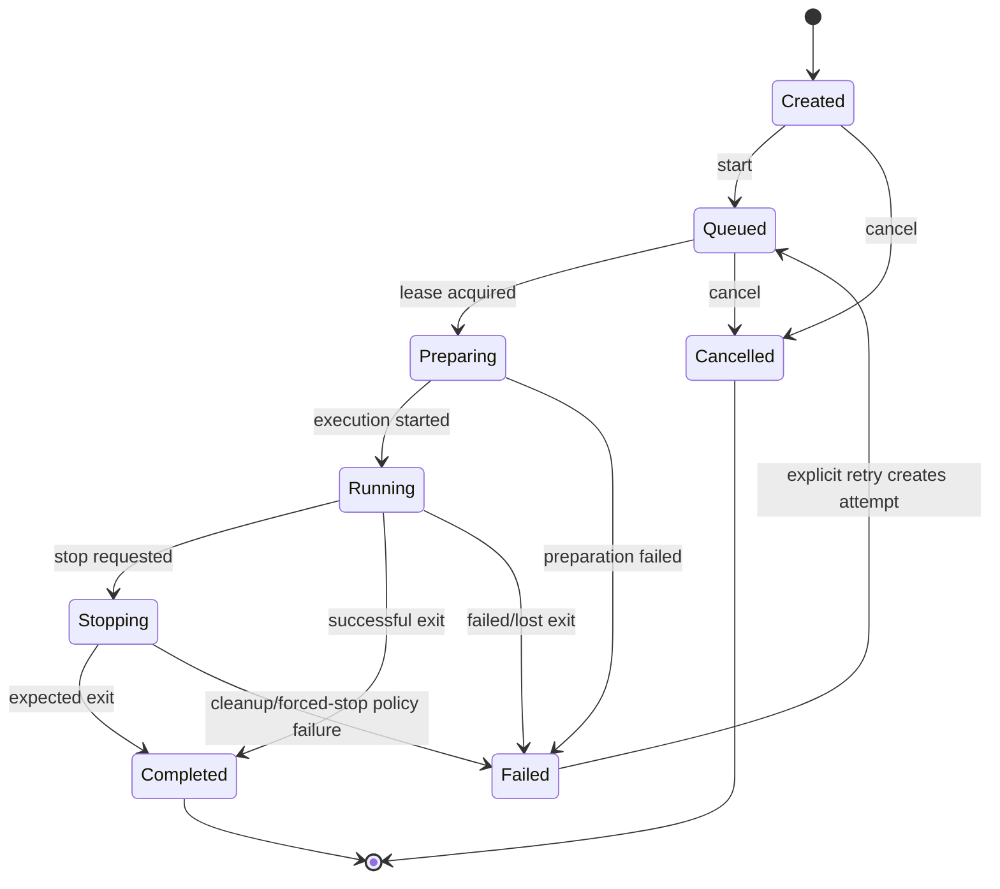

# Harness, runner, and event contracts

## 1. Run lifecycle



Terminal states are immutable. A retry creates a new attempt (and normally a
new execution) linked to the run; it never rewrites history. `stop` is
idempotent in `Stopping` and terminal states. Input is accepted only while the
adapter reports an input-capable state.

## 2. Canonical event envelope

All persisted and streamed events use a common envelope:

```json
{
  "eventId": "01J...",
  "runId": "01J...",
  "sequence": 42,
  "occurredAt": "2026-08-07T12:34:56.789Z",
  "kind": "assistant.message.delta",
  "schemaVersion": 1,
  "source": { "type": "harness", "adapter": "example", "version": "1.2.0" },
  "sensitivity": "user-content",
  "payload": { "messageId": "m1", "text": "..." },
  "extensions": { "example.vendor/v1": {} }
}
```

Rules:

- `sequence` is gap-free within successfully committed events for one run.
- `eventId` supports cross-system deduplication; consumers order by sequence,
  not timestamp or ID.
- `kind` and `schemaVersion` select a payload schema. Minor additive evolution
  does not change the version; incompatible meaning creates a new version.
- Unknown event kinds and extension namespaces are preserved or ignored, never
  treated as fatal by generic consumers.
- Sensitivity drives retention, export, telemetry, and display policy.

Initial event families are lifecycle, raw stream, user/assistant/system message,
tool call/result, approval request/resolution, file change, artifact, usage,
diagnostic, and workflow linkage.

## 3. Input commands

User input is a command rather than an event until accepted. It contains a
client-generated idempotency key, expected run state/optional last sequence,
actor identity, and one typed payload: text, structured answer, approval,
interrupt, terminal bytes, or resize. The application persists acceptance and
an outbox record before delivery. The resulting event cites the command ID.

Raw terminal input is a separately authorized capability because it can bypass
structured approval or redaction semantics.

## 4. Runner protocol

The remote-capable protocol has four conceptual streams:

1. **registration/heartbeat:** runner identity, supported protocol range,
   harness/sandbox capabilities, load, and lease epoch;
2. **commands:** prepare/start/input/resize/stop/inspect/cleanup with command IDs;
3. **events:** observed lifecycle and unsequenced harness output; and
4. **artifact transfer:** content-addressed upload or signed-storage handoff.

The control plane assigns durable run sequence numbers. Runner events carry a
runner-local ordinal, command correlation ID, execution ID, and lease token.
Events with a stale token are rejected and retained only in runner diagnostics.

Protocol negotiation selects the highest mutually supported major/minor
version. A major mismatch refuses assignment. Within a major version, fields
are additive and receivers ignore unknown fields. Payload size, outstanding
commands, and event buffering are bounded to provide backpressure.

## 5. Streaming API behavior

1. Client fetches `GET /runs/{id}` and an event page/snapshot.
2. Client opens the authenticated stream with `after_sequence=N`.
3. Server sends ordered events, periodic heartbeat, and an explicit
   `caught_up` marker.
4. On a sequence gap or reconnect, client requests missing persisted events.
5. Slow clients are disconnected with a resumable last-sequence indication;
   execution is never backpressured by an individual browser.

Authorization is checked when connecting and periodically/relevantly during a
long-lived stream. The WebSocket origin is validated. Short-lived stream tokens
are preferable to placing a long-lived bearer token in a URL.

## 6. Rendering contract

Renderers receive immutable, already-authorized event view models rather than
database objects or raw secret-bearing launch data. A renderer declares:

- supported event kinds/schema versions;
- output view-model schema and renderer version;
- whether it is incremental or needs a bounded history window; and
- fallback behavior.

Built-in projections include:

- **terminal:** ANSI stream interpreted in a sandboxed terminal component;
- **conversation:** messages and deltas coalesced by message ID;
- **activity:** tools, approvals, lifecycle, and usage as cards;
- **changes:** file-change events and artifact-backed diffs.

Persist canonical events, not HTML. Optionally cache renderer output by
`run/event-range + renderer-version`; it is always disposable. Markdown and
ANSI output are treated as untrusted, HTML is sanitized, links are constrained,
and browser content security policy prevents script execution.

## 7. Workflow definition contract

Workflow definitions are versioned declarative graphs. Each step declares its
type, inputs (literal or prior outputs), retry/timeout policy, compensation if
applicable, and stable step ID. A minimal set is:

- `run.start`, `run.send`, `run.stop`;
- `event.wait` with a typed predicate and deadline;
- `approval.wait`;
- `condition`, `parallel`, and `foreach` with bounded concurrency; and
- `artifact.publish`.

Definitions cannot embed arbitrary server code. Custom behavior uses a
registered, policy-controlled activity. Instances pin a definition version and
harness/sandbox profiles. Step commands use deterministic idempotency keys based
on workflow instance, step, and attempt so coordinator replay does not duplicate
external effects.
