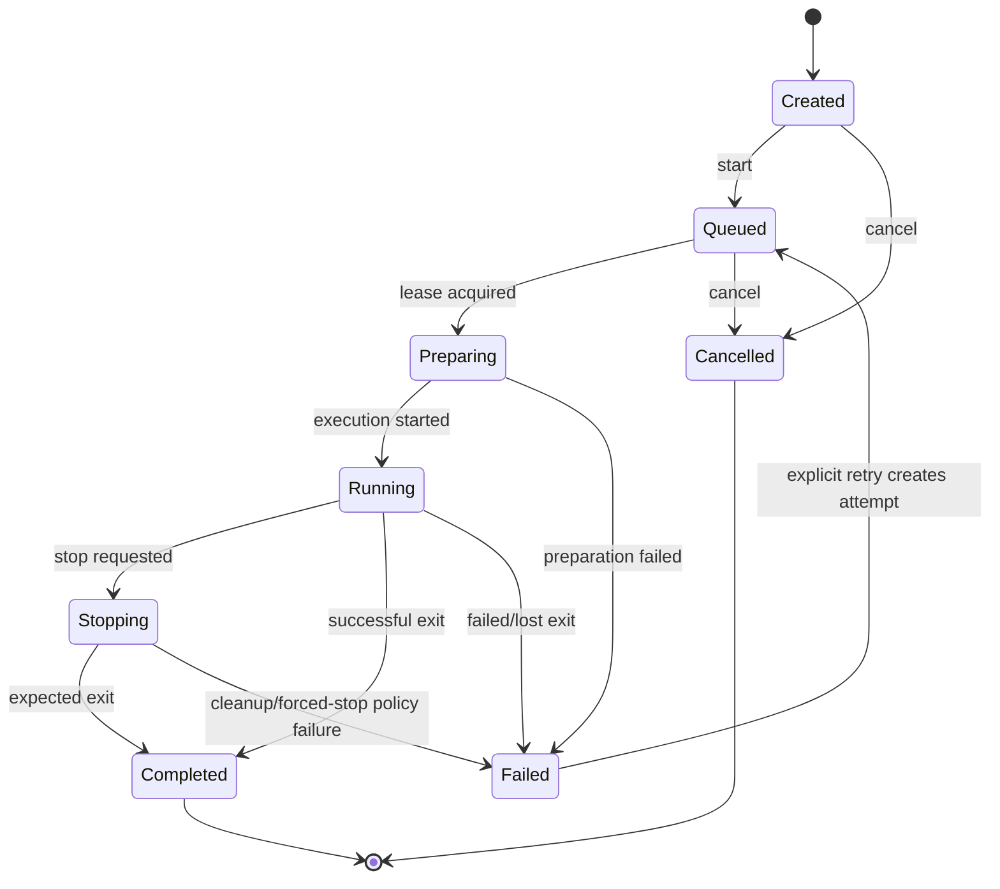

# Harness, runner, and event contracts

Sections 1 through 7 are the **control plane's** contracts. They bind a
deployment that has one; they do not bind a standalone sandbox, which has a
session rather than a run and serves the narrower contract in §8. Where a
capability exists at both levels — input submission, ordered records, resume —
§8 is the earlier and smaller of the two, and the control plane wraps it rather
than replacing it.

## 1. Run lifecycle


```mermaid
stateDiagram-v2
  [*] --> Created
  Created --> Queued: start
  Queued --> Preparing: lease acquired
  Preparing --> Running: execution started
  Preparing --> Failed: preparation failed
  Running --> Stopping: stop requested
  Running --> Completed: successful exit
  Running --> Failed: failed/lost exit
  Stopping --> Completed: expected exit
  Stopping --> Failed: cleanup/forced-stop policy failure
  Queued --> Cancelled: cancel
  Created --> Cancelled: cancel
  Failed --> Queued: explicit retry creates attempt
  Completed --> [*]
  Cancelled --> [*]
```

Terminal states are immutable. A retry creates a new attempt (and normally a
new execution) linked to the run; it never rewrites history. `stop` is
idempotent in `Stopping` and terminal states. Input is accepted only while the
adapter reports an input-capable state.

`start` resolves the run's persisted harness and sandbox profiles against the
pair the deployment actually constructed, per
[ADR-0003](decisions/0003-capability-based-adapters.md): a combination it cannot
run is refused with the stable `unsupported_profile` code before any sandbox is
prepared, rather than silently degrading to one it can. The refusal names the
run and never the rejected profiles. Because a run's profiles are fixed at
creation, this is not a validation failure the caller can correct by retrying.

`start` is conditional rather than idempotent: it requires the run's current
ETag, and a repeat against a run that has already left `created` is a state
conflict, so one run never acquires two executions.

Creation is idempotent per `(actor, idempotency key)`; input commands scope the
same guarantee to a run, which a run being created does not yet have. A repeated
key from the same actor returns the run the first request created — same ID,
same version, and the `201` the operation documents rather than a second run.
The comparison is over the request's declared fields, the workspace path and the
harness and sandbox profiles: identical fields replay, and any difference is an
idempotency conflict, so callers must retry with the same key and must not
invent a new key after an ambiguous response. A key is kept for the life of the
run it created and is not otherwise expired. A run no client request created —
one a workflow spawns, say — carries no key and deduplicates against nothing.

## 2. Canonical event envelope

This envelope is the control plane's. A runner produces records with a
runner-local ordinal and no canonical `sequence`, as
[the package structure](code-structure.md#3-principal-ports) requires of it; the
control plane assigns `sequence`, `eventId`, and the authoritative `occurredAt`
ordering when it persists. A standalone sandbox therefore serves records that
carry an ordinal and not a sequence, and consumers of §8 order by ordinal.
Whether promotion wraps the runner's record shape or replaces it is roadmap
decision D7.

All persisted and streamed events use a common envelope:

```json
{
  "eventId": "01J...",
  "runId": "01J...",
  "sequence": 42,
  "occurredAt": "2026-08-07T12:34:56.789Z",
  "kind": "assistant.message.delta",
  "schemaVersion": 1,
  "source": { "type": "harness", "adapter": "example", "version": "1.2.0" },
  "sensitivity": "user-content",
  "payload": { "messageId": "m1", "text": "..." },
  "extensions": { "example.vendor/v1": {} }
}
```

Rules:

- `sequence` is gap-free within successfully committed events for one run.
- `eventId` supports cross-system deduplication; consumers order by sequence,
  not timestamp or ID.
- `kind` and `schemaVersion` select a payload schema. Minor additive evolution
  does not change the version; incompatible meaning creates a new version.
- Unknown event kinds and extension namespaces are preserved or ignored, never
  treated as fatal by generic consumers.
- Sensitivity is one of `public`, `operational`, `user-content`, `confidential`,
  or `secret`. Producers must choose the most restrictive applicable class;
  unknown or missing values are treated as `confidential`. Sensitivity drives
  the retention, export, telemetry, and deletion defaults in
  [the security model](security.md#5-data-handling-and-retention-defaults).

Initial event families are lifecycle, raw stream, user/assistant/system message,
tool call/result, approval request/resolution, file change, artifact, usage,
diagnostic, and workflow linkage.

## 3. Input commands

User input is a command rather than an event until accepted. It contains a
client-generated idempotency key, expected run state/optional last sequence,
actor identity, and one typed payload: text, structured answer, approval,
interrupt, terminal bytes, or resize. The application persists acceptance and
an outbox record before delivery. The resulting event cites the command ID.

Raw terminal input is a separately authorized capability because it can bypass
structured approval or redaction semantics.

The first delivery slice accepts `text`, `interrupt`, `terminal_bytes`, and
`resize`. Acceptance checks the adapter's explicit input modes and current
input-capable state, plus the caller's expected state and optional last event
sequence. A repeated `(run ID, idempotency key)` returns the command ID and kind
recorded by the first request; callers must retry with the same key and must not
invent a new command ID after an ambiguous response. Acceptance and the
`run.input` outbox intent commit in one transaction, so a daemon restart can
resume delivery. Stable rejection codes are `INPUT_INVALID`,
`INPUT_UNAUTHORIZED`, `INPUT_UNSUPPORTED`, `INPUT_STALE_STATE`, and
`INPUT_RUN_NOT_FOUND`. Diagnostics may include run ID, command ID, and input
kind, but must not include payload content, actor credentials, or lease tokens.

## 4. Runner protocol

The remote-capable protocol has four conceptual streams:

1. **registration/heartbeat:** runner identity, supported protocol range,
   harness/sandbox capabilities, load, and lease epoch;
2. **commands:** prepare/start/input/resize/stop/inspect/cleanup with command IDs;
3. **events:** observed lifecycle and unsequenced harness output; and
4. **artifact transfer:** content-addressed upload or signed-storage handoff.

The control plane assigns durable run sequence numbers. Runner events carry a
runner-local ordinal, command correlation ID, execution ID, and lease token.
Events with a stale token are rejected and retained only in runner diagnostics.

Protocol negotiation selects the highest mutually supported major/minor
version. A major mismatch refuses assignment. Within a major version, fields
are additive and receivers ignore unknown fields. Payload size, outstanding
commands, and event buffering are bounded to provide backpressure.

## 5. Streaming API behavior

1. Client fetches `GET /runs/{id}` and an event page/snapshot.
2. Client opens the authenticated stream with `after_sequence=N`.
3. Server sends ordered events, periodic heartbeat, and an explicit
   `caught_up` marker.
4. On a sequence gap or reconnect, client requests missing persisted events.
5. Slow clients are disconnected with a resumable last-sequence indication;
   execution is never backpressured by an individual browser.

Authorization is checked when connecting and periodically/relevantly during a
long-lived stream. The WebSocket origin is validated. Short-lived stream tokens
are preferable to placing a long-lived bearer token in a URL.

## 6. Rendering contract

Renderers receive immutable, already-authorized event view models rather than
database objects or raw secret-bearing launch data. A renderer declares:

- supported event kinds/schema versions;
- output view-model schema and renderer version;
- whether it is incremental or needs a bounded history window; and
- fallback behavior.

Built-in projections include:

- **terminal:** ANSI stream interpreted in a sandboxed terminal component;
- **conversation:** messages and deltas coalesced by message ID;
- **activity:** tools, approvals, lifecycle, and usage as cards;
- **changes:** file-change events and artifact-backed diffs.

Persist canonical events, not HTML. Optionally cache renderer output by
`run/event-range + renderer-version`; it is always disposable. Markdown and
ANSI output are treated as untrusted, HTML is sanitized, links are constrained,
and browser content security policy prevents script execution.

## 7. Workflow definition contract

Workflow definitions are versioned declarative graphs. Each step declares its
type, inputs (literal or prior outputs), retry/timeout policy, compensation if
applicable, and stable step ID. A minimal set is:

- `run.start`, `run.send`, `run.stop`;
- `event.wait` with a typed predicate and deadline;
- `approval.wait`;
- `condition`, `parallel`, and `foreach` with bounded concurrency; and
- `artifact.publish`.

Definitions cannot embed arbitrary server code. Custom behavior uses a
registered, policy-controlled activity. Instances pin a definition version and
harness/sandbox profiles. Step commands use deterministic idempotency keys based
on workflow instance, step, and attempt so coordinator replay does not duplicate
external effects.

## 8. Sandbox attach contract

What a sandbox serves over its own surface, for the one session inside it. This
is the only contract a standalone sandbox has, and it holds whether or not a
control plane is deployed. [ADR-0006](decisions/0006-two-interaction-surfaces.md)
states why it stays narrow.

**Session, not run.** There is one session per sandbox, implied by the sandbox
itself rather than addressed by an identifier the caller chooses. The surface
exposes no collection: no listing, no creation, no selection. The run lifecycle
in §1 does not apply, and the states it names are not reported here.

**Records are ordinal-ordered.** Every record the runner collects carries a
runner-local ordinal, monotonically increasing and gap-free within the session.
Consumers order by ordinal, never by timestamp. Records carry no canonical
`sequence` and no `eventId`; §2 says what the control plane adds.

**Reading is snapshot plus stream.** A caller fetches records from an ordinal and
opens a stream from an ordinal, the same shape as §5 and without the
authorization reattachment a long-lived control-plane stream needs. The stream
emits a heartbeat and an explicit caught-up marker. On a gap or a reconnect, the
caller refetches from its last ordinal. A slow reader is disconnected with its
last ordinal and never backpressures the harness.

**Input is accepted or refused, never queued silently.** A submission carries an
idempotency key scoped to the session and one typed payload, from the same set
§3 defines. The runner checks the harness adapter's declared input modes and
whether the harness is currently input-capable. A repeated key returns the first
submission's identifier and kind. Refusal uses the §3 codes that have meaning
without a run — `INPUT_INVALID`, `INPUT_UNSUPPORTED`, `INPUT_UNAUTHORIZED` — and
diagnostics name the ordinal and the input kind but never payload content.

**Harness exit is a record, not a state machine.** When the harness exits, the
runner emits a terminal record carrying the native exit and its mapped outcome,
and the session accepts no further input. There is no retry and no new attempt:
restarting means starting another sandbox, which is what makes the run aggregate
the control plane's job rather than the runner's.

**The surface states its posture.** It reports the sandbox profile in force and
what that profile does not isolate, so a caller cannot be misled about effective
isolation — threat T02 in [the security model](security.md#3-threat-and-mitigation-register).
The standalone surface exposes `GET /healthz` as
`{"service":"winch-sandbox","status":"ok"}` and `GET /api/session` as
`{"profile": string, "unenforcedControls": string[]}`. The unenforced-controls
array is non-empty; for `container-standard` it includes `network-egress`.

## 9. Fake runtime profile contract

The fake is a supported way to exercise product behavior without a vendor
account. Its contract is reproducible scenarios through the product surface,
runtime selection of transcripts and delay, and injection of the failures the
implemented capability supports. The introducing brief documents those controls
and what the fake does not prove. New controls arrive with the concern they
exercise; a catalogue of possible controls does not require bundling their
product handling into one task.

The fake's process protocol is internal development infrastructure. Its current
JSON-lines dialect, `kind` and `sensitivity` fields, `-run-id` flag, and signal
handler do not define the sandbox attach contract or the canonical event model.
The runner owns the product record envelope and maps harness output into it.
It must not blindly promote invented fake fields into that contract.

An increment may change the fake's protocol or controls along with its callers,
scenario fixtures, tests, and operator documentation. Preserve the supported
behavior; require exact interface compatibility only where a documented
consumer needs it. Declare affected profile configuration and product surfaces
in the brief so concurrent tasks can reconcile them. No change to the fake
executable is made merely by this distinction; the introducing implementation
chooses and documents the simplest protocol its scenarios need.
