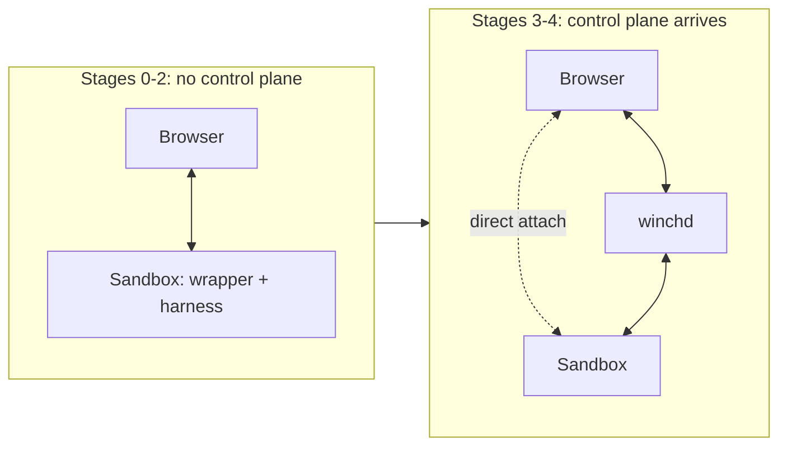

# Delivery roadmap

This is the order in which Code Winch becomes real. It sits between the design
set, which describes a finished system, and `docs/workplan/`, which decomposes
one stage at a time into tasks.

Stage N maps onto workplan phase N, so numbering starts at zero and `P0-001` is
the first task of the plan derived from this document.

## 1. How this roadmap is ordered

The previous arc worked down from the design set: control plane, domain model,
supervisor, event store, and a user interface somewhere past all of it. It
produced no configuration anybody could start. This one inverts the order, and
four rules do the inverting.

**Runnable before designed.** The first stage ships a thing you start and talk
to. Abstractions arrive when a second case forces them, not in advance of the
first. A port with one implementation is a stage that came too early.

**Each stage removes one manual step, or adds one observable capability.** Never
both, and never neither. At Stage 0 you start the sandbox by hand and there is
no such thing as a run; four stages later the control plane starts runs for you.
Every step between those is one of those two kinds of change, which is what
makes a stage boundary checkable rather than a matter of taste.

**Inside a stage, the interaction surface leads.** Build the page, then the
handler behind it, then the store behind that. An inert surface is a legitimate
place to stop for the day; a backend nothing reaches is not. This is the reverse
of the layer order the design documents are written in, and deliberately so —
the design documents describe a destination, not a build order.

**Every increment closes its own loop.** An increment is scoped so something
observable comes back at its own depth, not so that the deepest version of a
capability lands all at once. A static page is observable. An input control that
echoes what you typed back into the page is observable. The same control
persisting what you submitted is observable by reloading. The same submission
reaching the harness is observable by the harness's reply. Those are four closed
loops, not one loop with three deferrals — which is why they are four tasks, and
why none of them is a task that postpones its own operability.

## 2. The arc

The sandbox does not lose its own surface when the control plane arrives. The
two surfaces have different jobs, which [ADR-0006](decisions/0006-two-interaction-surfaces.md)
states and this roadmap assumes throughout.

| Stage | What becomes true | Hand check at the end |
|---|---|---|
| 0 | One container holds the wrapper and the fake harness, serves a page, and keeps its own ordered record | Start it, type a line, the fake harness echoes, and the exchange survives a reload |
| 1 | One real vendor CLI runs behind the same wrapper; the fake remains a shipped profile | The same demonstration against a real agent, and the fake profile still passes |
| 2 | The session is legible and rejoinable: records beyond raw stream, more than one view, resume by ordinal | Reconnect mid-session and lose nothing; switch between the terminal and conversation views |
| 3 | `winchd` observes sandboxes it did not start | Start two sandboxes by hand and see both in one place |
| 4 | `winchd` starts and stops them — runs, lifecycle, leases, canonical sequence numbers | Create and stop a run from the product surface without touching a terminal |
| 5 | Isolation, credentials, and egress are real rather than declared | Attempt egress and traversal, and watch them refused |
| 6 | A second harness adapter, and workflows across runs | Run two vendors; drive a workflow spanning two runs |

## 3. Stages

### Stage 0 — A sandbox you can talk to

One container image holds the wrapper and the fake harness. You start it by
hand. It serves a page on a port, and over the course of the stage that page
goes from static, to showing what the harness said, to letting you say something
back, to remembering both.

The wrapper is the runner, living inside the sandbox — see
[ADR-0005](decisions/0005-sandbox-resident-runner.md). It owns the harness
process, the codec, and a private ordered record store. Nothing in this stage
knows what a run is; the sandbox has a session, and that is all.

Stage 0 also carries the repository's floor. The Makefile and both CI workflows
currently name paths that no longer exist, so the first task truncates them to
what the stage actually builds and leaves the gates green. That is required
wiring for a stage whose first invariant is that the system starts and deploys —
not a cleanup task of its own.

*Deliberately absent:* runs and run lifecycle, the control plane, more than one
harness, more than one sandbox, authentication beyond a loopback binding,
canonical event sequence numbers, schema version negotiation, renderers as a
plural concept, credentials, workflows.

### Stage 1 — A real agent behind the same surface

The fake harness is swapped for one real vendor CLI behind the same wrapper and
the same page. The fake does not retire: it stays a supported way to run the
product, controllable by transcript, delay, and injected failure, because every
later stage is developed against it.

A real CLI is what forces the harness adapter to be a seam rather than a
function — capability descriptors, launch construction, native-to-canonical
decoding, and whatever login the vendor requires. It may also force terminal
semantics the fake never needed; that is deferred decision D5.

*Deliberately absent:* a second vendor. One real adapter proves the seam; two is
Stage 6's job, and building both here would be designing the abstraction before
the second case exists.

### Stage 2 — A session you can read and rejoin

The output path deepens. Raw stream is not a useful reading of a coding agent's
work, so this is where records gain structure — messages, tool calls, file
changes — and where the page gains a second view over the same records. It is
also where you can close the browser, come back, and resume by ordinal without a
gap.

This stage is what makes [ADR-0002](decisions/0002-canonical-events-and-renderers.md)
earn its place: the separation of records from their projections pays for itself
the moment there are two projections, and not before.

*Deliberately absent:* cross-session history, search, export, retention policy.

### Stage 3 — One place that lists the sandboxes you started

`winchd` appears, and it is deliberately weak: you still start sandboxes by
hand, but they register themselves with it, and it lists them and routes you to
their surfaces. The first cross-sandbox view, and the first time the runner
protocol crosses a process boundary for real.

The durable run record arrives here, as a record of something already running
rather than an instruction to start something. That ordering is the point — the
hard part of the run aggregate is lifecycle, and lifecycle is Stage 4.

*Deliberately absent:* starting anything, stopping anything, leases, scheduling,
multi-user access.

### Stage 4 — The control plane starts and stops runs

The manual step goes away. `winchd` creates runs, prepares sandboxes, starts and
stops them, and owns the lifecycle in `docs/contracts.md` §1 — the state machine,
idempotency keys, the transactional outbox, lease fencing, canonical gap-free
sequence numbers, and reconciliation after restart.

The sandbox's own surface keeps working throughout, as the operator path. When a
run misbehaves, attaching to the sandbox directly is how you find out why.

*Deliberately absent:* the security posture that a shared deployment needs. This
stage completes the product loop for a single user on a loopback binding; it
does not make the deployment safe to share.

### Stage 5 — Isolation, credentials, and egress become real

Everything in `docs/security.md` that earlier stages declared rather than
enforced: egress denied by default with an explicit allowlist, the named
profiles, credential references with scoped short-lived injection, redaction
before persistence, traversal and symlink defenses, stop escalation and orphan
cleanup. Demonstrated by attack attempts that visibly fail, not by happy paths.

This is the gate in front of any deployment more than one person can reach. The
launch blockers in `docs/security.md` §11 are the checklist.

### Stage 6 — A second vendor, and workflows across runs

The second harness adapter, which is what actually tests whether the Stage 1
seam was a seam. Then workflows: the durable graph in `docs/contracts.md` §7,
issuing ordinary commands and waiting on domain events.

## 4. Two paths through the early stages

Stages 0 and 1 have two independent paths, and naming them is what keeps the
plan derived from this roadmap wide rather than a single chain:

- **Output path** — read what the harness emits, show it in the page
  ephemerally, persist it, replay it on reload.
- **Input path** — an input control that echoes locally, then persists what you
  submitted, then delivers it to the harness.

They meet only at the page and at the store, so they proceed concurrently. Each
step on each path is a closed loop under rule 4.

## 5. Deployment posture

| Stages | Posture |
|---|---|
| 0–2 | One sandbox container, started by hand, bound to loopback. No control plane, no accounts, no network policy. |
| 3–4 | Control plane plus sandboxes on one host, still loopback, still one user. |
| 5+ | The first posture that may be exposed beyond one machine, gated on `docs/security.md` §11. |

Stating this is a control, not a disclaimer: T02 in the threat register makes
misleading a user about effective isolation a tracked threat, so the surface has
to say what it is at every stage.

## 6. Deferred decisions

Open questions with explicit triggers. A workplan brief may cite one of these as
the owner of a deferral; a question with no trigger is not an entry here.

| ID | Question | Deferred because | Revisit when |
|---|---|---|---|
| D1 | Which vendor CLI Stage 1 integrates first | The choice does not change the seam, and the fake proves the seam | Stage 1 opens |
| D2 | Whether the sandbox surface and the product app share one web workspace or are two | There is only one surface before Stage 3, so the question has no content yet | Stage 3's product surface needs its first component that the sandbox surface already has |
| D3 | What substrate the sandbox's private store uses, and whether it outlives one session | A single-session ordered record is satisfied by the simplest thing that persists | The sandbox must present history from a session that has already ended |
| D4 | Whether the attach surface and the runner protocol are one protocol or two | Before Stage 3 there is no runner protocol to unify with | Stage 3 defines registration and the control plane's first command |
| D5 | Whether harness I/O needs a PTY or pipes suffice | The fake harness speaks JSON lines on pipes and needs no terminal | The first real harness requires terminal semantics — resize, raw mode, or TTY detection |
| D6 | How `winchd` learns a sandbox exists — registration, scan, or supervision | All three are reasonable, and nothing before Stage 3 distinguishes them | Stage 3 opens |
| D7 | Whether the canonical envelope replaces the sandbox's record shape or wraps it | The sandbox emits runner-local ordinals by design; the envelope is the control plane's contract | The control plane first persists records a sandbox produced |

## 7. What this roadmap does not decide

Task decomposition, dependency edges, write sets, and contract surfaces. Those
belong to `docs/workplan/` and the model in
[`skills/shared/workplan-model.md`](../skills/shared/workplan-model.md). This
document fixes the order and the stage boundaries; the plan derived from it
decides how a stage is cut into tasks.

[`docs/state.md`](state.md) records what actually exists at HEAD. Where it and
this roadmap disagree about whether something is built, `state.md` is right.
